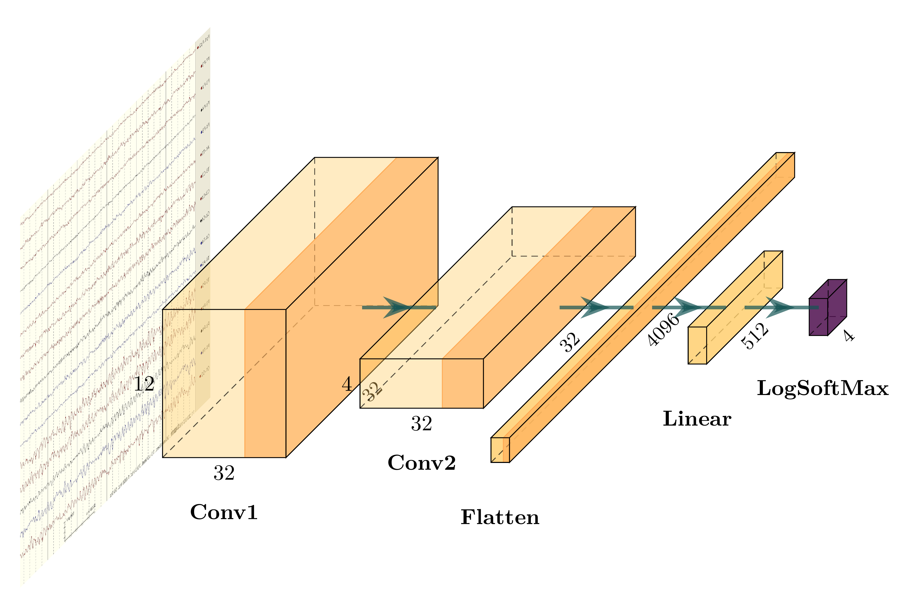
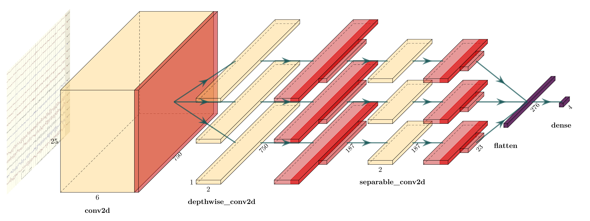

# Changes and additions based on PlotNeuralNet

## Box.sty

Path: layers/Box.sty

```diff
diff --git a/B.sty b/Box.sty
index 38818a8..854edbb 100644
--- a/B.sty
+++ b/Box.sty
@@ -42,13 +42,13 @@

         \coordinate (a1) at (0 , \y/2 , \z/2);
         \coordinate (b1) at (0 ,-\y/2 , \z/2);
-        \tikzstyle{depthlabel}=[pos=0,text width=14*\z,text centered,sloped]
+        \tikzstyle{depthlabel}=[pos=0.5,text width=14*\z,text centered,sloped]

         \path (c) edge ["\small\zlabel"',depthlabel](f); %depth label
         \path (b1) edge ["\ylabel",midway] (a1);  %height label


-        \tikzstyle{captionlabel}=[text width=15*\LastEastx/\scale,text centered]
+        \tikzstyle{captionlabel}=[text width=2cm,text centered]
         \path (\LastEastx/2,-\y/2,+\z/2) + (0,-25pt) coordinate (cap)
         edge ["\textcolor{black}{ \bf \caption}"',captionlabel](cap) ; %Block caption/pic object label

```
`Box.sty` is the revised version.

## RightBandedBox.sty

Path: layers/RightBandedBox.sty

```diff
diff --git a/R.sty b/RightBandedBox.sty
index 7d74a51..adad188 100644
--- a/R.sty
+++ b/RightBandedBox.sty
@@ -60,12 +60,12 @@

         \coordinate (a1) at (0 , \y/2 , \z/2);
         \coordinate (b1) at (0 ,-\y/2 , \z/2);
-        \tikzstyle{depthlabel}=[pos=0,text width=14*\z,text centered,sloped]
+        \tikzstyle{depthlabel}=[pos=0.5,text width=14*\z,text centered,sloped]

         \path (c) edge ["\small\zlabels"',depthlabel](f); %depth label
         \path (b1) edge ["\ylabel",midway] (a1);  %height label

-        \tikzstyle{captionlabel}=[text width=15*\LastEastx/\scale,text centered]
+        \tikzstyle{captionlabel}=[text width=3cm,text centered]
         \path (\LastEastx/2,-\y/2,+\z/2) + (0,-25pt) coordinate (cap)
         edge ["\textcolor{black}{ \bf \caption}"',captionlabel] (cap); %Block caption/pic object label

```
`RightBandedBox.sty` is the revised version.

## tikzeng.py
Path: pycore/tikzeng.py

- Modify SoftmaxColor

- Add PoolReluColor

- Add to_Linear function

- Add to_LinearRelu function

- Modify to_Conv function
    - Input parameters changed from "s_fiter, n_filter" to "x, y, n_filter"
        - x: depth (the length of feature map)
        - y: height (the width of feature map)
        - n_filter: width (number of the convolution kernel)

- Modify to_Pool function

- Add to_PoolRelu function

- Add to_ConvRelu function

- Add to_dashed_connection function

- Add to_dashed_connection_half function

- Add to_Flatten function

More details at [tikzeng.py](./pycore/tikzeng.py)


## My example

<p align="center"></p>
<h6 align="center">my example</h6>

Code of the example in [my_example.py](./my_examples/my_example.py)

<p align="center"></p>
<h6 align="center">EEGNet</h6>

Code of the example in [EEGNet.py](./EEGNet/EEGNet.py)

<!--<p align="center"></p>-->
<!--<h6 align="center">test_simple</h6>-->

<!--Code of the example in [test_simple.py](./pyexamples/test_simple.py)-->

<!--<p align="center"></p>-->
<!--<h6 align="center">unet</h6>-->

<!--Code of the example in [unet.py](./pyexamples/unet.py)-->


The following is the original description


---
# PlotNeuralNet
[](https://doi.org/10.5281/zenodo.2526396)

Latex code for drawing neural networks for reports and presentation. Have a look into examples to see how they are made. Additionally, lets consolidate any improvements that you make and fix any bugs to help more people with this code.

## Examples

Following are some network representations:

<p align="center"></p>
<h6 align="center">FCN-8</h6>


<p align="center"></p>
<h6 align="center">FCN-32</h6>


<p align="center"></p>
<h6 align="center">Holistically-Nested Edge Detection</h6>

## Getting Started
1. Install the following packages on Ubuntu.
    * Ubuntu 16.04
        ```
        sudo apt-get install texlive-latex-extra
        ```

    * Ubuntu 18.04.2
Base on this [website](https://gist.github.com/rain1024/98dd5e2c6c8c28f9ea9d), please install the following packages.
        ```
        sudo apt-get install texlive-latex-base
        sudo apt-get install texlive-fonts-recommended
        sudo apt-get install texlive-fonts-extra
        sudo apt-get install texlive-latex-extra
        ```

    * Windows
    1. Download and install [MikTeX](https://miktex.org/download).
    2. Download and install bash runner on Windows, recommends [Git bash](https://git-scm.com/download/win) or Cygwin(https://www.cygwin.com/)

2. Execute the example as followed.
    ```
    cd pyexamples/
    bash ../tikzmake.sh test_simple
    ```

## TODO

- [X] Python interface
- [ ] Add easy legend functionality
- [ ] Add more layer shapes like TruncatedPyramid, 2DSheet etc
- [ ] Add examples for RNN and likes.

## Latex usage

See [`examples`](examples) directory for usage.

## Python usage

First, create a new directory and a new Python file:

    $ mkdir my_project
    $ cd my_project
    vim my_arch.py

Add the following code to your new file:

```python
import sys
sys.path.append('../')
from pycore.tikzeng import *

# defined your arch
arch = [
    to_head( '..' ),
    to_cor(),
    to_begin(),
    to_Conv("conv1", 512, 64, offset="(0,0,0)", to="(0,0,0)", height=64, depth=64, width=2 ),
    to_Pool("pool1", offset="(0,0,0)", to="(conv1-east)"),
    to_Conv("conv2", 128, 64, offset="(1,0,0)", to="(pool1-east)", height=32, depth=32, width=2 ),
    to_connection( "pool1", "conv2"),
    to_Pool("pool2", offset="(0,0,0)", to="(conv2-east)", height=28, depth=28, width=1),
    to_SoftMax("soft1", 10 ,"(3,0,0)", "(pool1-east)", caption="SOFT"  ),
    to_connection("pool2", "soft1"),
    to_end()
    ]

def main():
    namefile = str(sys.argv[0]).split('.')[0]
    to_generate(arch, namefile + '.tex' )

if __name__ == '__main__':
    main()
```

Now, run the program as follows:

    bash ../tikzmake.sh my_arch


